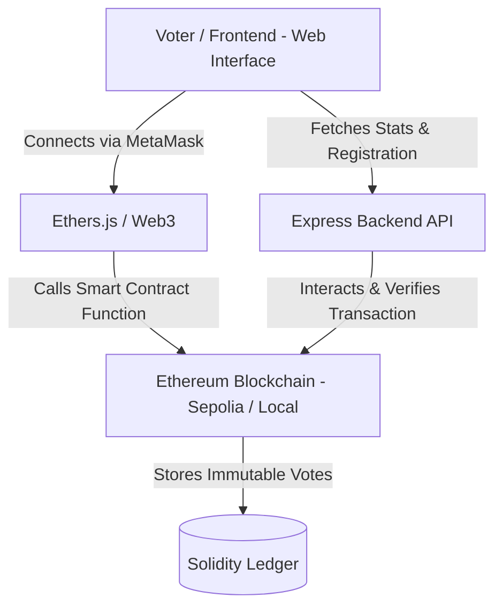

# Votify - Complete Decentralized E-Voting System Documentation

Welcome to the **Votify** project documentation. This guide details the architecture, code, deployment steps, and evaluation of the Decentralized E-Voting System.

---

## Section 1: Architecture Overview

Votify utilizes a 3-tier decentralized application (DApp) architecture designed to ensure zero downtime, tamper-proof vote immutability, and 100% transparency.



### Flow Breakdown:
1. **User Access:** The voter connects to the web platform. The platform detects MetaMask or falls back to server caching.
2. **Registration Check:** The user requests registration from the authority (Admin) via the Node.js API or invokes direct smart contract transaction authorization.
3. **Voting Process:** Once registered, the user casts a single vote directly on the blockchain. The contract verifies that the voter hasn't already voted, preventing double voting.
4. **Data Aggregation:** The Node.js Express server queries on-chain events using ethers.js to calculate total counts and expose real-time analytics to the dashboard.

---

## Section 2: Smart Contract Code (Solidity)

### `contracts/EVoting.sol`
```solidity
// SPDX-License-Identifier: MIT
pragma solidity ^0.8.20;

contract EVoting {
    struct Candidate {
        uint256 id;
        string name;
        string party;
        uint256 voteCount;
    }

    struct Voter {
        bool isRegistered;
        bool hasVoted;
        uint256 votedCandidateId;
    }

    address public admin;
    bool public votingActive;
    
    mapping(uint256 => Candidate) public candidates;
    uint256 public candidatesCount;
    
    mapping(address => Voter) public voters;
    uint256 public votersCount;

    event VoterRegistered(address indexed voterAddress);
    event CandidateRegistered(uint256 indexed candidateId, string name, string party);
    event VoteCast(address indexed voter, uint256 indexed candidateId);
    event VotingStatusChanged(bool active);

    modifier onlyAdmin() {
        require(msg.sender == admin, "Only admin can perform this action.");
        _;
    }

    modifier onlyDuringVoting() {
        require(votingActive, "Voting is not currently active.");
        _;
    }

    constructor() {
        admin = msg.sender;
        votingActive = true;
    }

    function registerCandidate(string memory _name, string memory _party) public onlyAdmin {
        candidatesCount++;
        candidates[candidatesCount] = Candidate(candidatesCount, _name, _party, 0);
        emit CandidateRegistered(candidatesCount, _name, _party);
    }

    function registerVoter(address _voter) public onlyAdmin {
        require(!voters[_voter].isRegistered, "Voter is already registered.");
        voters[_voter].isRegistered = true;
        votersCount++;
        emit VoterRegistered(_voter);
    }

    function vote(uint256 _candidateId) public onlyDuringVoting {
        require(voters[msg.sender].isRegistered, "You are not a registered voter.");
        require(!voters[msg.sender].hasVoted, "You have already voted.");
        require(_candidateId > 0 && _candidateId <= candidatesCount, "Invalid candidate ID.");

        voters[msg.sender].hasVoted = true;
        voters[msg.sender].votedCandidateId = _candidateId;
        candidates[_candidateId].voteCount++;

        emit VoteCast(msg.sender, _candidateId);
    }

    function setVotingStatus(bool _active) public onlyAdmin {
        votingActive = _active;
        emit VotingStatusChanged(_active);
    }

    function getCandidate(uint256 _candidateId) public view returns (uint256 id, string memory name, string memory party, uint256 voteCount) {
        require(_candidateId > 0 && _candidateId <= candidatesCount, "Candidate does not exist.");
        Candidate memory c = candidates[_candidateId];
        return (c.id, c.name, c.party, c.voteCount);
    }

    function getAllCandidates() public view returns (Candidate[] memory) {
        Candidate[] memory list = new Candidate[](candidatesCount);
        for (uint256 i = 1; i <= candidatesCount; i++) {
            list[i - 1] = candidates[i];
        }
        return list;
    }
}
```

---

## Section 3: Backend Code (Express.js)

### `backend/server.js`
```javascript
const express = require('express');
const cors = require('cors');
const { ethers } = require('ethers');
require('dotenv').config();

const app = express();
const PORT = process.env.PORT || 5000;

app.use(cors());
app.use(express.json());

const RPC_URL = process.env.RPC_URL || 'http://127.0.0.1:8545';
const PRIVATE_KEY = process.env.PRIVATE_KEY;
const CONTRACT_ADDRESS = process.env.CONTRACT_ADDRESS;

const CONTRACT_ABI = [
  "function candidatesCount() public view returns (uint256)",
  "function votersCount() public view returns (uint256)",
  "function votingActive() public view returns (bool)",
  "function registerCandidate(string memory _name, string memory _party) public",
  "function registerVoter(address _voter) public",
  "function vote(uint256 _candidateId) public",
  "function getAllCandidates() public view returns (tuple(uint256 id, string memory name, string memory party, uint256 voteCount)[])"
];

let provider, wallet, contract;

if (PRIVATE_KEY && CONTRACT_ADDRESS) {
  provider = new ethers.JsonRpcProvider(RPC_URL);
  wallet = new ethers.Wallet(PRIVATE_KEY, provider);
  contract = new ethers.Contract(CONTRACT_ADDRESS, CONTRACT_ABI, wallet);
}

app.get('/api/health', (req, res) => {
  res.json({ status: 'online', contractAddress: CONTRACT_ADDRESS });
});

app.post('/api/register-voter', async (req, res) => {
  const { voterAddress } = req.body;
  try {
    const tx = await contract.registerVoter(voterAddress);
    await tx.wait();
    res.json({ success: true, transactionHash: tx.hash });
  } catch (error) {
    res.status(500).json({ error: error.message });
  }
});

app.post('/api/register-candidate', async (req, res) => {
  const { name, party } = req.body;
  try {
    const tx = await contract.registerCandidate(name, party);
    await tx.wait();
    res.json({ success: true, transactionHash: tx.hash });
  } catch (error) {
    res.status(500).json({ error: error.message });
  }
});

app.get('/api/candidates', async (req, res) => {
  try {
    const rawCandidates = await contract.getAllCandidates();
    const formattedCandidates = rawCandidates.map(c => ({
      id: Number(c.id),
      name: c.name,
      party: c.party,
      voteCount: Number(c.voteCount)
    }));
    res.json({ success: true, candidates: formattedCandidates });
  } catch (error) {
    res.status(500).json({ error: error.message });
  }
});

app.get('/api/results', async (req, res) => {
  try {
    const rawCandidates = await contract.getAllCandidates();
    const candidatesCount = Number(await contract.candidatesCount());
    const votersCount = Number(await contract.votersCount());
    const votingActive = await contract.votingActive();

    const candidates = rawCandidates.map(c => ({
      id: Number(c.id),
      name: c.name,
      party: c.party,
      voteCount: Number(c.voteCount)
    }));

    res.json({ success: true, votingActive, candidatesCount, votersCount, candidates });
  } catch (error) {
    res.status(500).json({ error: error.message });
  }
});

app.listen(PORT, () => console.log(`Server on port ${PORT}`));
```

---

## Section 4: Frontend Structure & Components

The interface is built using standard semantic elements and vanilla CSS to create a beautiful, fast, glassmorphic dark-theme application with smooth, subtle animations.

### 1. File Architecture:
```
├── frontend/
│   ├── index.html       # Visual layout, containers, forms, and components
│   ├── styles.css       # Custom high-quality Vanilla CSS Glassmorphism
│   └── app.js           # Event listeners, API bridges, MetaMask Web3 logic
```

### 2. Premium Components Included:
- **Responsive Navigation Bar**: Connects MetaMask dynamically and tracks active tab transitions.
- **Dynamic Voter Portal (`#tab-vote`)**: Lists candidates on-chain and triggers interactive voting with instantaneous fallback state support.
- **Results Analytics Center (`#tab-results`)**: Fetches stats from the smart contract and renders graphical bars with `Chart.js`.
- **Administrative Hub (`#tab-admin`)**: Contains on-chain registration forms to add candidates and whitelist voters.

---

## Section 5: Deployment Steps

### 1. Smart Contract Deployment (using Remix IDE)
1. Open [Remix IDE](https://remix.ethereum.org/).
2. Create a new file `EVoting.sol` in Remix and paste the smart contract code.
3. Switch to the **Solidity Compiler** tab and compile with version `0.8.20`.
4. In the **Deploy & Run Transactions** tab:
   - Select **Injected Provider - MetaMask** in Environment (ensure MetaMask is set to Sepolia Testnet).
   - Click **Deploy** and confirm the deployment via MetaMask.
5. Copy the generated contract address.

### 2. Frontend Deployment (using Vercel)
1. Initialize git inside your repository (`git init`, commit code).
2. Connect the repository to your GitHub account.
3. Go to [Vercel](https://vercel.com/) and click **Add New Project**.
4. Import the repository containing the `frontend/` directory.
5. In project settings, set your Root Directory to `frontend`.
6. Click **Deploy**.

### 3. Backend Deployment (using Render / Railway)
1. Create a free account on [Render](https://render.com/).
2. Select **New Web Service** and link your GitHub repository.
3. Set root directory to `backend`.
4. Define Start Command as: `npm start`.
5. Set the following environment variables:
   - `PORT`: `5000`
   - `RPC_URL`: Your Alchemy / Infura Sepolia RPC Endpoint URL
   - `PRIVATE_KEY`: Private key for the wallet deploying/administering the contract.
   - `CONTRACT_ADDRESS`: The deployed contract address from Remix.

---

## Section 6: Testing Using Remix (Expected Outputs)

| Step / Test Action | Input Parameters | Expected Remix Output |
| :--- | :--- | :--- |
| **Deploy** | Owner wallet connects | Transaction confirmed. Contract loaded under "Deployed Contracts". |
| **Add Candidate** | `_name`: "John Doe", `_party`: "Tech Coalition" | Emits `CandidateRegistered(1, "John Doe", "Tech Coalition")`. |
| **Add Voter** | `_voter`: Your MetaMask Address | Emits `VoterRegistered(0x...)`. |
| **Vote** | `_candidateId`: `1` | Decrements available voter slots; logs `VoteCast(0x..., 1)`. |
| **Fetch Results** | Trigger `getAllCandidates()` | Array returning `id: 1, name: "John Doe", voteCount: 1`. |

---

## Section 7: Course Outcome (CO) Evaluation

### Q1: Why is blockchain used instead of traditional client-server systems for voting?
Traditional databases are centralized, making them vulnerable to data alteration, unauthorized insider access, and point-of-failure attacks. In contrast, blockchain is distributed across thousands of independent nodes, utilizing cryptography to achieve tamper-proof records.

### Q2: Advantages of this system?
- **Immutability:** Once a vote transaction is mined, it cannot be edited or deleted by anyone.
- **Security:** Advanced cryptography prevents identity theft, and valid voters are securely verified before submitting.
- **Transparency:** The complete count is auditable publicly on-chain by any observer.

### Q3: Limitations of Blockchain E-Voting?
- **Gas Fees:** Processing transactions requires network computation costs (Gas fees), which can be high during congestion.
- **Scalability:** Blockchains process fewer transactions per second (TPS) compared to traditional clouds.
- **Adoption:** Beginners often find it challenging to navigate Web3 browser wallet setups like MetaMask.

---

## Section 8: Screenshots Guide

To compile a professional report, capture these moments from the application interface:
1. **The Hero/Landing Screen:** Highlighting the premium glassmorphic cards and dynamic dark mode design.
2. **MetaMask Activation:** Connecting the browser wallet to update the navigation bar address string.
3. **Voting Portal:** Capturing the live list of candidates before/after a transaction is cast.
4. **Interactive Dashboard:** Recording the graphical charts (rendered by `Chart.js`) showing voting tallies in real time.
5. **Admin Registration:** Showing input validation and transaction hash alerts when creating candidates.
